# A 2.5D Raycasting Game Engine

A brand-new, old-school game-engine inspired by the likes of [Wolfenstein 3D (1992)](https://en.wikipedia.org/wiki/Wolfenstein_3D) and [Ultima Underworld: The Stygian Abyss (1992)](https://en.wikipedia.org/wiki/Ultima_Underworld:_The_Stygian_Abyss). Uses simple raycasting techniques and a uniform cell grid to render 3D.

See previous versions of this project at: [v1](https://github.com/con-dog/sdl-test) [v2](https://github.com/con-dog/sdl-textured) [v3](https://github.com/con-dog/2.5D-raycasting-engine)

## Build and run

### Native

The native build needs a C11 compiler, CMake 3.20+, and SDL3. With SDL3 installed as a system CMake package:

```sh
cmake -S . -B build-native -DCMAKE_BUILD_TYPE=Release
cmake --build build-native
./build-native/raycaster
```

Pass `-DRAYCASTER_FETCH_SDL=ON` while configuring to download the pinned SDL3 release instead. The smaller Make build remains available on systems where `pkg-config sdl3` works:

```sh
make
./main
```

### Browser / WebAssembly

Install and activate the latest [Emscripten SDK](https://emscripten.org/docs/getting_started/downloads.html), then configure with its CMake wrapper. The web build fetches its own pinned SDL3 source by default.

```sh
source /path/to/emsdk/emsdk_env.sh
emcmake cmake -S . -B build-web -DCMAKE_BUILD_TYPE=Release
cmake --build build-web
python3 -m http.server 8000 --directory build-web
```

Open [http://localhost:8000/](http://localhost:8000/). Serve the files over HTTP rather than opening the HTML with `file://`. A release build produces `index.html`, `index.js`, `index.wasm`, the web manifest, icon, and social preview image; deploy those together on any static host that serves `.wasm` as `application/wasm`.

The generated metadata and canonical links target this repository's GitHub Pages project URL, [https://con-dog.github.io/chunked-z-level-raycaster/](https://con-dog.github.io/chunked-z-level-raycaster/). Update those URLs in `web/shell.html` if the site moves to a custom domain.

### GitHub Pages deployment

The Pages workflow builds and deploys the WebAssembly site whenever `master` is pushed, and it can also be started manually from the Actions tab. Before its first run, open the repository's **Settings → Pages** and set **Source** to **GitHub Actions**. The workflow uploads only the deployable files, leaving CMake and downloaded SDL build files out of the published artifact.

The current chunk and colours are compiled into the executable, so runtime assets are excluded from the default download. To expose the repository's `assets/` and `manifests/` paths through Emscripten's virtual filesystem for the texture/level loaders, configure with:

```sh
emcmake cmake -S . -B build-web \
  -DCMAKE_BUILD_TYPE=Release \
  -DRAYCASTER_WEB_PRELOAD_ASSETS=ON
```

This adds `index.data` to the files that must be deployed.

Controls: use the arrow keys to move and turn, and hold Shift to sprint. The browser shell scales the fixed 1024×512 logical view to its container and includes a fullscreen control.

### Browser smoke test

[`scripts/smoke-web.mjs`](./scripts/smoke-web.mjs) checks that a served build initializes without browser errors, creates a responsive 2:1 canvas, renders a screenshot, and accepts keyboard input. Start Chrome or Chromium with a DevTools port, then run:

```sh
chromium --headless=new \
  --remote-debugging-port=9222 \
  --user-data-dir=/tmp/raycaster-smoke \
  about:blank

# In another terminal:
node scripts/smoke-web.mjs \
  http://127.0.0.1:8000/ \
  http://127.0.0.1:9222
```

## Currently in Phase 6:

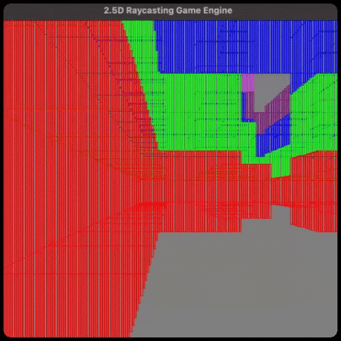

Vertical walls, chunks, representing a wall with 1 bit, and 2 bytes representing a vertical stack of 16 walls. Huge performance boosts (memory and speed) - But, having issues with rendering logic for verticals

|                                                                                       |                                                                                   |
| ------------------------------------------------------------------------------------- | --------------------------------------------------------------------------------- |
| 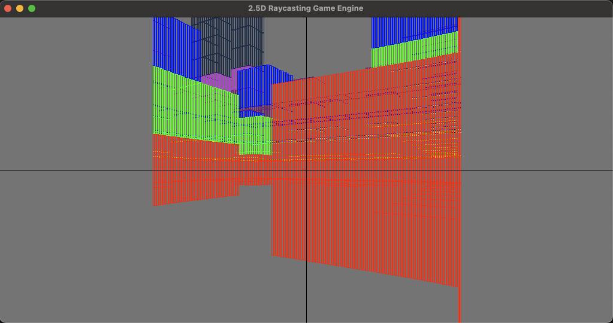 | 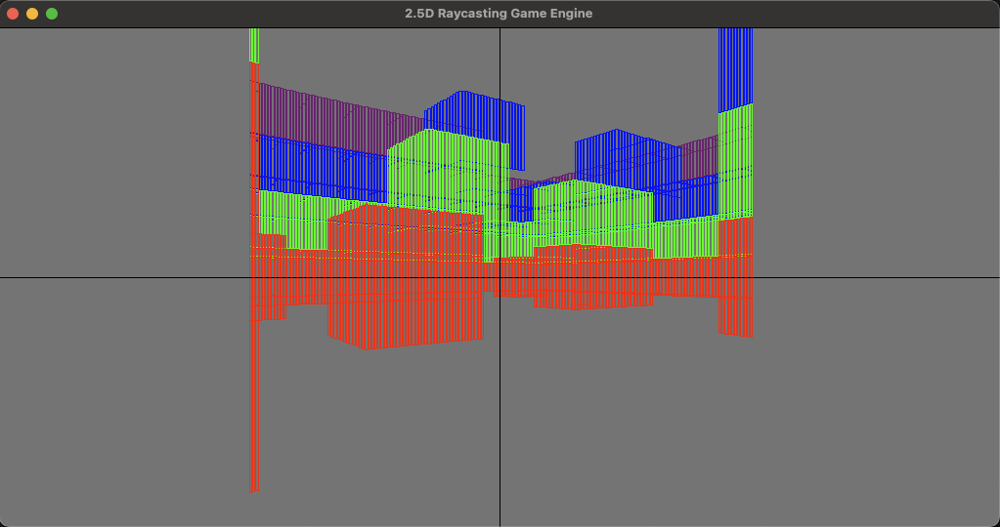 |
| 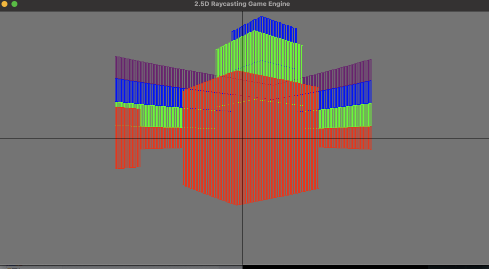                           | 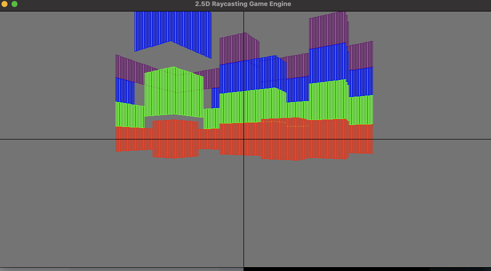             |

### Optimisations in Phase 6

Example of a 16x16x16 chunk of a map, where a bit '1' in binary represents a wall, where '0' represents no wall

```c
uint16_t map_chunk[CHUNK_X][CHUNK_Y] = { // 0x000F means z [0-3] has walls, z [3-15] has no walls
    {0x000F, 0x000F, 0x000F, 0x000F, 0x000F, 0x000F, 0x000F, 0x000F, 0x000F, 0x000F, 0x000F, 0x000F, 0x000F, 0x000F, 0x000F, 0x000F},
    {0x000F, 0x0000, 0x0000, 0x0000, 0x0000, 0x0000, 0x0000, 0x0000, 0x0000, 0x0000, 0x0000, 0x0000, 0x0000, 0x0000, 0x0000, 0x000F},
    {0x000F, 0x0000, 0x0000, 0x0000, 0x0000, 0x0000, 0x0000, 0x0000, 0x0000, 0x0000, 0x0000, 0x0000, 0x0000, 0x0000, 0x0000, 0x000F},
    {0x000F, 0x0000, 0x0000, 0x0000, 0x0000, 0x0000, 0x0000, 0x0000, 0x0000, 0x0000, 0x0000, 0x0000, 0x0000, 0x0000, 0x0000, 0x000F},
    {0x000F, 0x0000, 0x0000, 0x0000, 0x0000, 0x0000, 0x0000, 0x0000, 0x0000, 0x0000, 0x0000, 0x0000, 0x0000, 0x0000, 0x0000, 0x000F},
    {0x000F, 0x0000, 0x0000, 0x0000, 0x0000, 0x0001, 0x0000, 0x0000, 0x0000, 0x0000, 0x0000, 0x0000, 0x0000, 0x0000, 0x0000, 0x000F},
    {0x000F, 0x0000, 0x0000, 0x000F, 0x0000, 0x0000, 0x0002, 0x0000, 0x0000, 0x0000, 0x0000, 0x0000, 0x0000, 0x0000, 0x0000, 0x000F},
    {0x000F, 0x0000, 0x0000, 0x0007, 0x0000, 0x0000, 0x0000, 0x0004, 0x0000, 0x0000, 0x0000, 0x0000, 0x0000, 0x0000, 0x0000, 0x000F},
    {0x000F, 0x0000, 0x0000, 0x0001, 0x0001, 0x0000, 0x0000, 0x0000, 0x0000, 0x0000, 0x0000, 0x0000, 0x0000, 0x0000, 0x0000, 0x000F},
    {0x000F, 0x0000, 0x0000, 0x000F, 0x0000, 0x0000, 0x0000, 0x0000, 0x0000, 0x0000, 0x0000, 0x0000, 0x0000, 0x0000, 0x0000, 0x000F},
    {0x000F, 0x0000, 0x0000, 0x0000, 0x0000, 0x0000, 0x0000, 0x0000, 0x0000, 0x0000, 0x0000, 0x0000, 0x0000, 0x0000, 0x0000, 0x000F},
    {0x000F, 0x0000, 0x0000, 0x0000, 0x0000, 0x0000, 0x0000, 0x0000, 0x0000, 0x0000, 0x0000, 0x0000, 0x0000, 0x0000, 0x0000, 0x000F},
    {0x000F, 0x0000, 0x0000, 0x0000, 0x0000, 0x0000, 0x0000, 0x0000, 0x0000, 0x0000, 0x0000, 0x0000, 0x0000, 0x0000, 0x0000, 0x000F},
    {0x000F, 0x0000, 0x0000, 0x0000, 0x0000, 0x0000, 0x0000, 0x0000, 0x0000, 0x0000, 0x0000, 0x0000, 0x0000, 0x0000, 0x0000, 0x000F},
    {0x000F, 0x0000, 0x0000, 0x0000, 0x0000, 0x0000, 0x0000, 0x0000, 0x0000, 0x0000, 0x0000, 0x0000, 0x0000, 0x0000, 0x0000, 0x000F},
    {0x000F, 0x000F, 0x000F, 0x000F, 0x000F, 0x000F, 0x000F, 0x000F, 0x000F, 0x000F, 0x000F, 0x000F, 0x000F, 0x000F, 0x000F, 0x000F}};
```

This is as memory efficient as I thought I could make a map chunk.

```plaintext
map_chunk_memory = 16x16x16 Bits
             = 512 bytes
```

The value 16 for a chunk dimension works nicely, as each actual wall (non-empty cells) will have an associated struct entry, and we can pack its x-y-z coordinate (0->15) into 4 bits per-axis, which means we can use a single uint16_t to represent the coordinate of the wall within a chunk, and have room to spare:

```c
typedef struct Wall
{
  uint16_t coord;      // coords in chunk - [4 flags/unused][4 bits x][4 bits y][4 bits z]
  uint16_t texture_id; // Texture ID -> Value of 0 means this isn't a wall, its empty
} Wall;
```

And for every wall there are 4 unused bits in the coord variable, that we can use as flags later on (collision modes, interactive wall etc). Could even use those 4 bits as part of the texture id, and drop the texture_id type to a uint8_t to save more memory if needed.

This is the memory footprint of 1 Wall:

```plaintext
wall_memory = 4 bytes
```

Then there is the question of the actual Chunk that stores the walls. Theoretically each chunk could store 16x16x16 = 4096 individual walls. But that memory footprint is 4bytes x 4096 = 16.384kB per chunk! But in reality, most chunks will be very sparse (sky etc empty cells) so most chunks will only need to store ~0-512 walls (just over 10% of the max). Knowing this, we can use a much smaller fixed sized array as a hash map for the actual walls in this chunk, only storing walls with data (non-empty).

For now I'm just using a fixed sized array given by `WALL_HASH_SIZE`, and hashing the given walls x-y-z wall coordinates with a hash function to determine an appropriate bounded index in the array to place the Wall. This hash does have collisions, so on item insertion I just keep incrementing the index until you find an empty index.

```c
typedef struct Chunk
{
  uint16_t coord;             // coords in world - [8 flags/unused][8 bits x][8 bits y][8 bits z]
  Wall walls[WALL_HASH_SIZE]; // Flat Array of entries, use hash_value as index into walls array
  size_t length;              // Number of non-empty walls, same as WALL_HASH_SIZE
} Chunk;

uint16_t do_hash_coords(uint8_t x, uint8_t y, uint8_t z)
{
  uint32_t hash = (x << 8) | (y << 4) | z;
  // Multiply by large prime
  hash *= 2654435761u;
  // Take bits 16-25 for better distribution
  return (hash >> 16) & 0x3FF;
}
```

Why do I use a fast hash map instead of a variable sized sorted array? Because I'm potentially going to be rendering a shitload of walls in one scene, I need instantaneous look-up times for walls within chunks and this method on average is `O(1)` access whereas binary search is `Olog2(n)` or a linked-list implementation is `O(n)`

That means on average, a chunk memory footprint is:

```plaintext
chunk = 4 bytes x 512 entries + (size_t + 2 bytes)
           ~= 2048 bytes
           ~= 2.048 Kilobytes
```

So a full map of 100x100x10 full chunks is ~204.8mB without compression.

Realistically however, most chunks (~80-90%) will be completely empty (sky , open areas etc) and so the final memory footprint is more like 204.8mB x 0.1 ~= 20.48mB on average. Pretty good! And then for chunks that aren't near the player, they can probably be compressed, getting further memory savings.

And just for completeness, here is the World data structure. Note that it only stores chunks that have content.

```
typedef struct World
{
  Chunk chunks[CHUNK_HASH_SIZE]; // Hashed chunks coords
  size_t length;                 // Number of chunks with walls, probably same as CHUNK_HASH_SIZE
  Point_3D extent;               // Max [x, y, z] of chunks
} World;
```

## Future Goals

- 100x100x10 chunks maps
- Texture Atlas, different tetxures per side of wall
- Lighting system
- Thin walls
- Destructible walls/buildable walls
- Remake / Demake a Pokemon town in this "engine"
- Add 8bit audio, music blocks/textures that make a sounds on collision
- Procedurally generated worlds
- Texture transparency (ray pass-through to next texture, for things like windows etc)
- Sprites are all square/rectangular like minecraft and always face the player, but can "change direction" by changing the texture currently displayed
- Separate drawing/raycasting logic from window width and height

## Previous phases

### Phase 5

Animated textures, floor/wall collisions based on surface manifest, walk through doors, and just for fun - sprites - fishing.


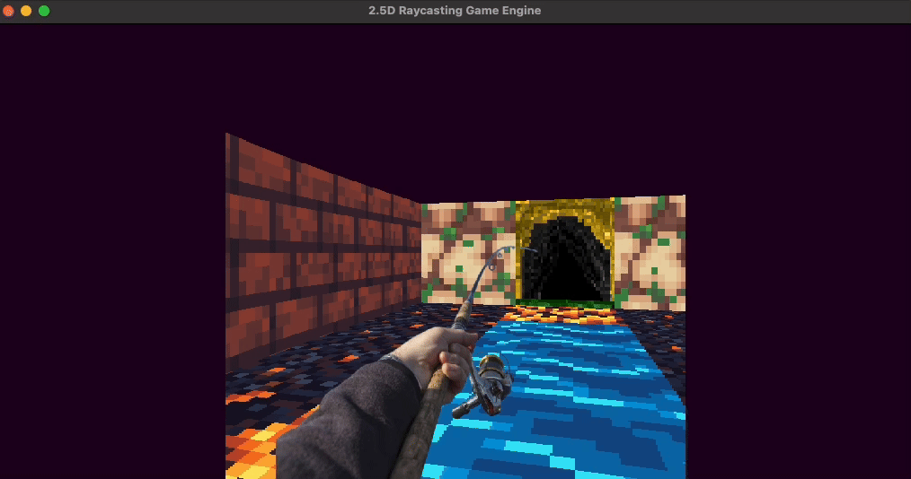
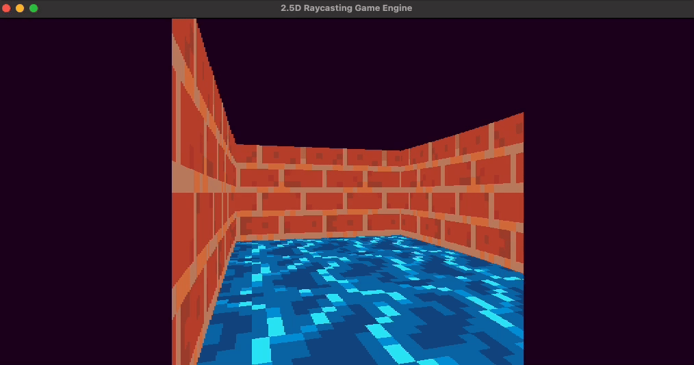
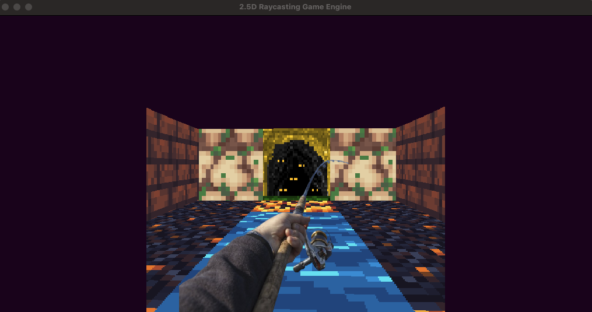

### Phase 4


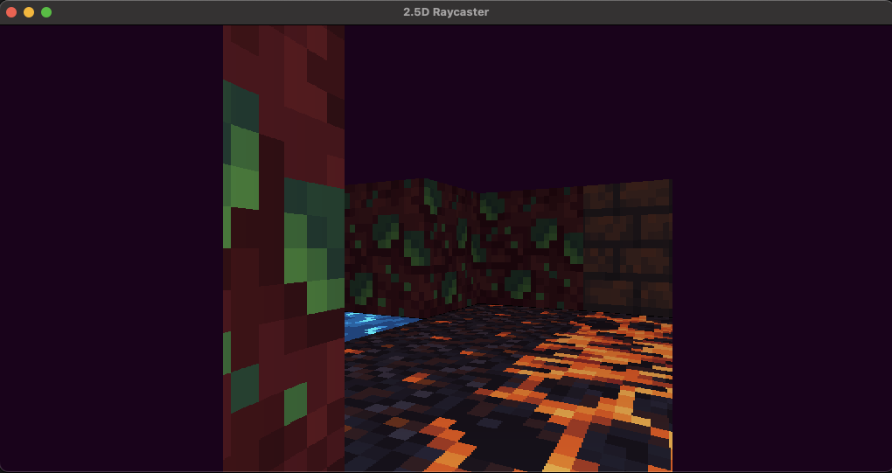
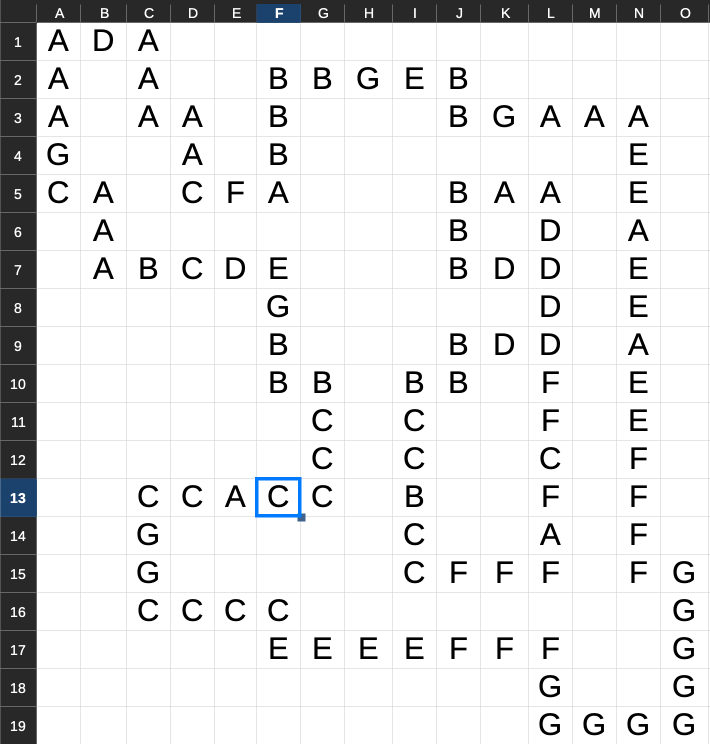

- Levels are represented in memory as Jagged Arrays (to save memory)
- Wall and Floor maps are just CSV's (So I can quickly make levels in Excel/LibreOffice)
- Wall and Floor textures are represented by strings so I can very quickly iterate
- Walls/Floors are separate CSV's (this needs runtime tests (todo) so memory access doesn't corrupt)
- Textures/Assets are declared via a manifest.json

### Phase 3


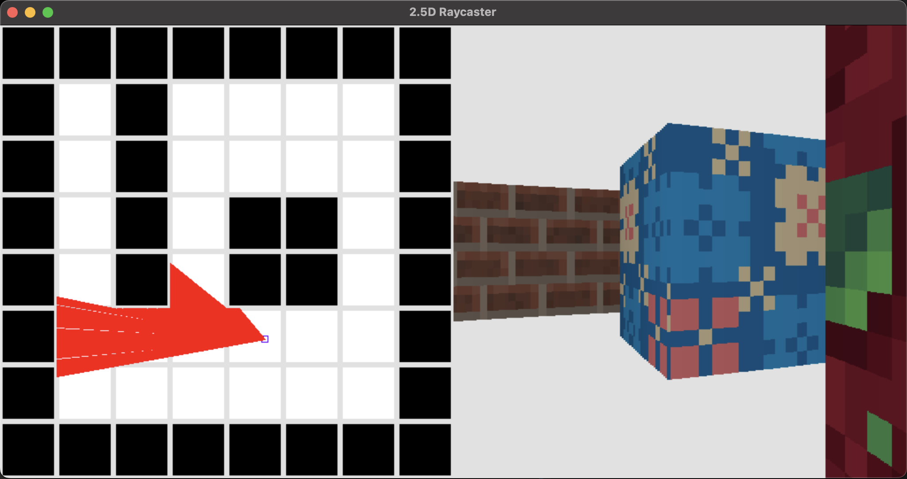

- Fixed visual artifacts and pixel densities

### Phase 2


- Wall collision detection
- Basic texture mapping for walls
- Very warped tetures with many artifacts

### Phase 1


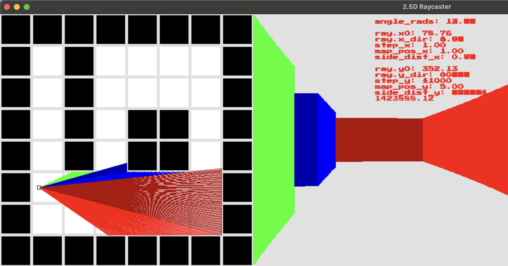

- Very basic ray-casting
- No collision detection
